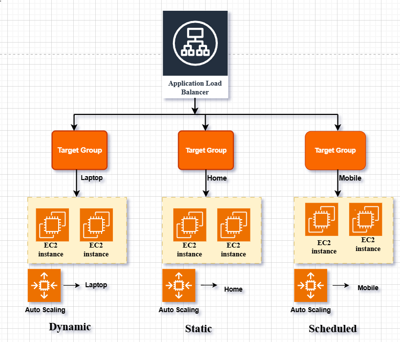
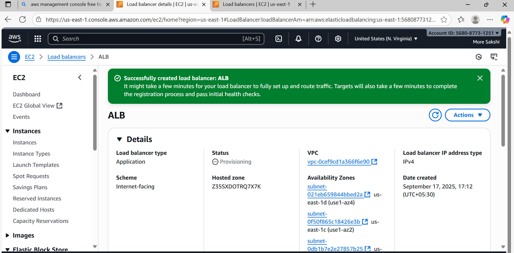
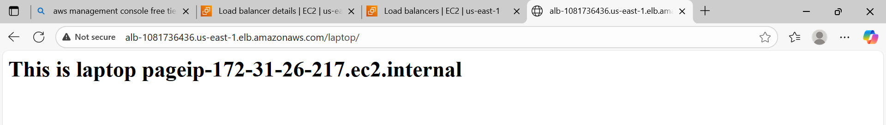
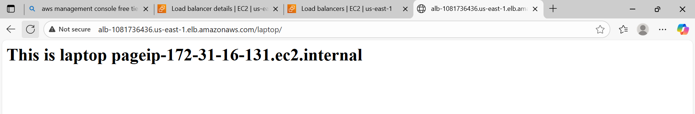
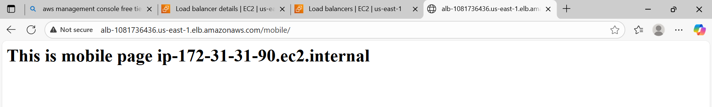
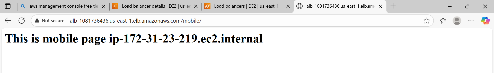

# Application Load Balancer Project

##  Introduction
This project demonstrates how to deploy an **Application Load Balancer (ALB)** in AWS by launching six EC2 instances and creating three target groups. The instances represent **Home**, **Laptop**, and **Mobile** servers. The ALB is configured to distribute traffic across these targets. Finally, the DNS name of the load balancer is tested to verify traffic distribution.

---

##  Overview

### 1. EC2 Instances
- Launch 6 EC2 instances: 
  - Two instances for **Home.**
  - Two intances for **Laptop.** 
  - Two instances for **Mobile.**
- Each instance runs Apache(httpd) web server
- Custom content is added to `index.html` using **User Data scripts**

### 2. Target Groups
- Create 3 target groups: one for two instance
- Register each EC2 instance to its respective target group

### 3. Application Load Balancer
- Create an ALB and attach the 3 target groups
- Configure listener on **HTTP (port 80)** to forward requests

---

## Steps to Implement

### Step 1: Launch EC2 Instances
- **AMI**: Amazon Linux
- **Instance Type**: t3.micro (Free Tier)
- Allow the inbound rules:
   - SSH (Port 22)
   - HTTP (Port 80)
- Add the following User Data scripts during launch:


###  Home Instance
```bash
#!/bin/bash
yum update -y
yum install -y httpd
systemctl start httpd
systemctl enable httpd
echo "<h1>This is home page $(hostname -f)</h1>" > /var/www/html/index.
```

### Laptop Instance
```bash
#!/bin/bash
yum update -y
yum install -y httpd
systemctl start httpd
systemctl enable httpd
mkdir /var/www/html/laptop
echo "<h1>This is laptop page $(hostname -f)</h1>" > /var/www/html/laptop/index.html
```

### Mobile Instance
```bash
#!/bin/bash
yum update -y
yum install -y httpd
systemctl start httpd
systemctl enable httpd
mkdir /var/www/html/mobile
echo "<h1>This is mobile page $(hostname -f)</h1>" > /var/www/html/mobile/index.html
```


---

## Step 2: Create Target Groups

 1. Navigate to Target Groups
- Go to **AWS Console → EC2 → Target Groups**
 **Create target group**

---
2. Create Target Group for 1.Home Instance
- **Target type**: Instance  
- **Protocol**: HTTP  
- **Port**: 80  
- **Name**: `home-TG`  

- **VPC**: Select the same VPC as your EC2 instance  
- Click **Next**
3. Register Targets
- Select the **Home EC2 instance**
- Click **Include as pending below**

- Click **Create target group**

---
 4. Create Target Group for Laptop Instance
- Repeat the same steps as above
- **Name**: `laptop-TG`
- Register the **Laptop EC2 instance**

---
5. Create Target Group for Mobile Instance
- Repeat the same steps again
- **Name**: `mobile-TG`
- Register the **Mobile EC2 instance**

---

## Step 3: Create Application Load Balancer
- Go to EC2 → Load Balancers → Create ALB
- Choose Application Load Balancer
- Configure:
- Listener: HTTP (port 80)
- Forwarding rules: Attach all 3 target groups

- Create Application Load Balancer

---
## Step 4: Test the Load Balancer
- Copy the DNS name of the ALB

- Open it in a browser and refresh multiple times
- You should see alternating responses:






## Summary
 deployed an Application Load Balancer (ALB) to efficiently distribute incoming traffic across six EC2 instances. Each instance was configured to serve a unique webpage using Apache, with setup automated through User Data scripts. To manage routing, created and registered three distinct target groups, ensuring organized traffic flow. The ALB listener was configured to forward requests to these target groups based on defined rules. After deployment, verified successful load balancing by accessing the ALB’s Endpoints, confirming that traffic was being evenly distributed and each instance responded as expected.


